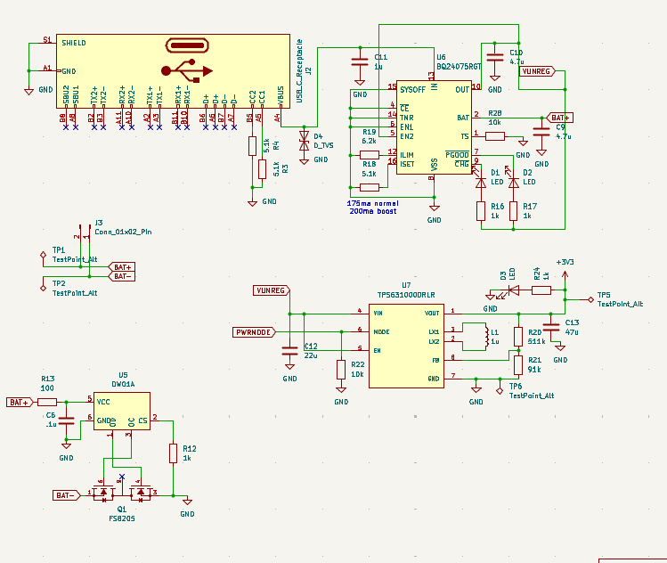
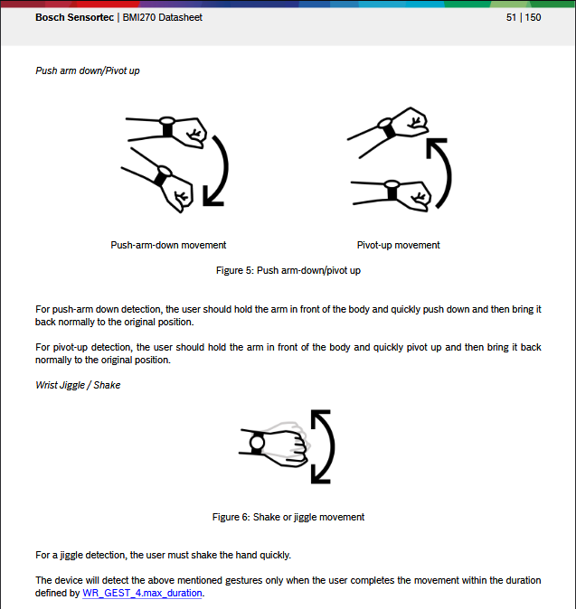
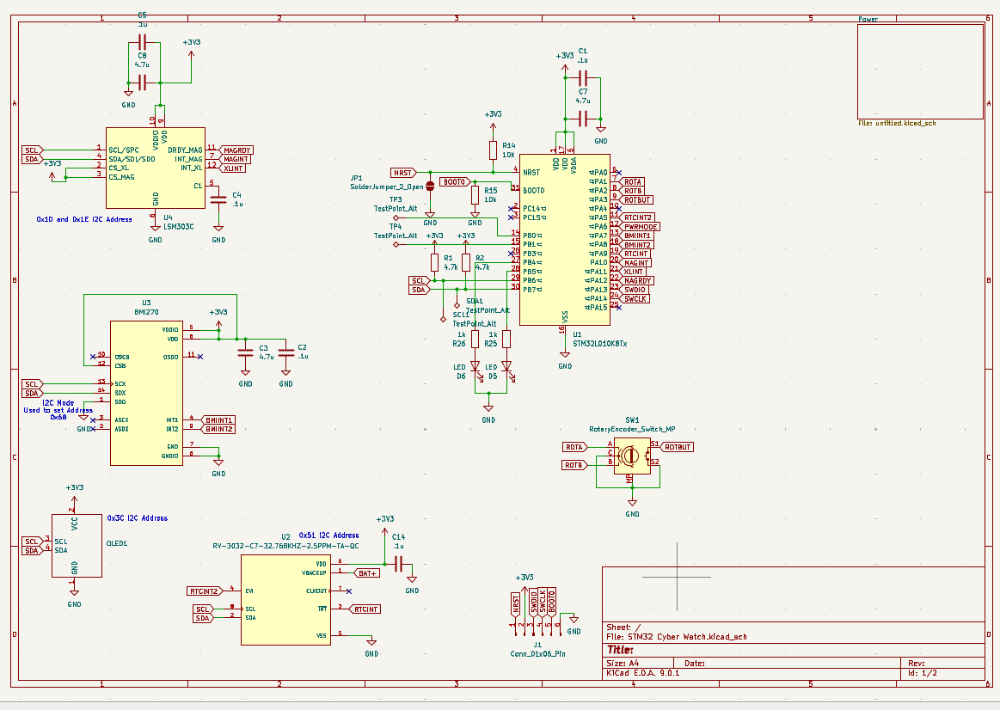
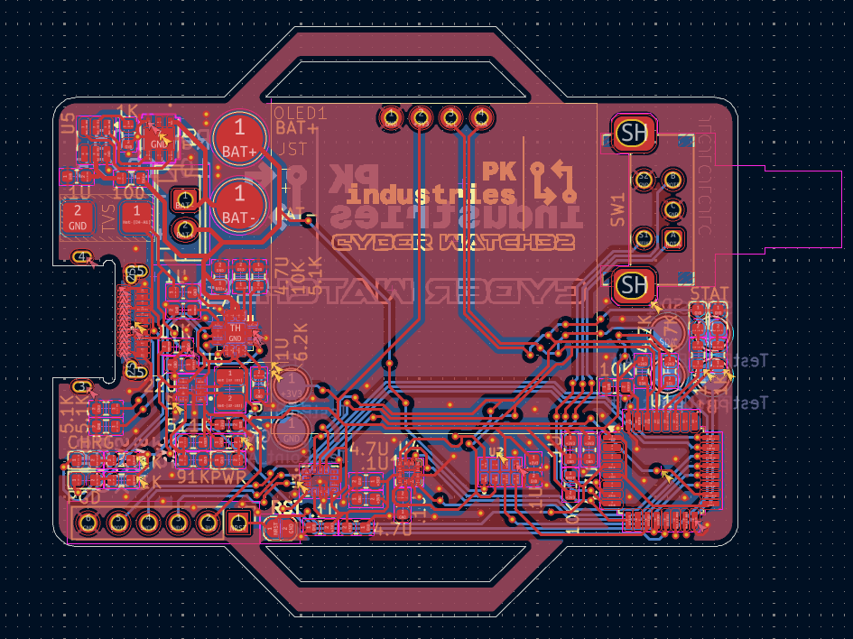
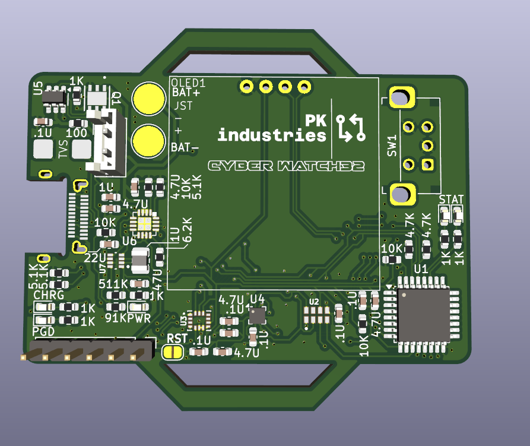

# CyberWatch32
A digital watch made with a custom circuit board and the STM32L0. Made to push the limits of low power wearable technology and my hardware skills

# The Original Project
This project originally started out as a very different project with the same goal. I started out with the CH32 Microprocessor, otherwise known as the 10 cent microcontroller. The first draft of this project used a real time clock, a 128px OLED display and the CH32. This would work in theory, but with the very limited RAM of the CH32 I was either going to have to get better at programming, or change the hardware.

# Draft 2
The second revision changed to the much more powerful STM32L010K8, which is used in the final board. This version made it all the way to a finished PCB design and right before I exported it for production, I noticed a critical flaw in the power management (dont let ChatGPT read datasheets for you) and I decided that a third revision was needed. 

## The Current Design - Power
The third and (currently) final design took a step back from the old project and aimed to do things correctly this time. Starting with a list of features, I wanted more than just a RTC. I specced out a new interital measurement unit and a magnetometer to give me a compass display. The biggest change however came from the power section. The design flaw from V2 comes from a concept known as powerpathing. the system runs on 3.3V, but USB is 5V and the LIPO battery is 3.7V my original design had no way to know what voltage is coming through and the components regulated them both the same, meaning the device would never work off of battery (you also can't just charge the battery with USB and always power off the battery, this is very dangerous and will harm the battery if you charge and discharge at the same time). The current design uses new power components to individually protect, charge, and regulate the power to provide a stable and clean 3.3V all of the time.

## The Current Design - Logic
Moving to the new sensors I decided on 3. The RV 3032 c7 real time clock. This claims to be the "most accurate clock" and it seemed simple enough with only 8 pins. This was super easy to wire in, includes optional backup power, the only downside is that it's a little expensive and hard to find, but available for around $4-5 on DigiKey. The inertial measurement unit is perhaps my favorite part. The chip is the BMI270 from... Bosch? Yeah, the same German power tool company also makes semiconductors. Apparently it's mostly for automotive applications, but this sensor seems to be fully designed for wearable watches. Perfect. The only bad part is the documentation. The pinout comes 140 pages into a 150 page reference doc, but at least it gives us some great application advice.

The LSM303 chip from STM is used for a magnetometer, but also includes a second IMU in order to correct the compass measurements. This one has a couple drop in replacements so the schematic specifies the older 303c model, but the 303agr is what I bought and the 303ahr should also work. The main differences are swapped I2C addresses, different drivers required and higher measurement resolution, but are all pin compatible and share the same footprint.

## Board Design
After designing the entire board once already, I was determined to make this board the best possible and take my time so I didn't have to have a 15 day+ delay from ordering and shipping the PCB. The board is sectioned off into power management on the left side, and logic on the bottom right. There are a lot of traces on the board, with all but 6 pins of the MCU being used. In total 140 vias are used and everything just barely manages to fit in 2 layers. There are also cutouts in the top and bottom for a watch strap. 

# Take Aways
This was my hardest project I've ever designed, and only my 3rd PCB made. This taught me a lot about reading datasheets, good board layout, and proper documentation. I focused a lot on nice to haves, like labeling every component value, putting 5 Debug LEDS, and making a compact circuit board in only 2 layers. This was a lot of work though so my next project will be simpler. I think I can improve in the future by creating a better and more visual silkscreen.

The board and components are in shipping and have not been received yet. No software has been created yet. Check back in Mid November 2025.

